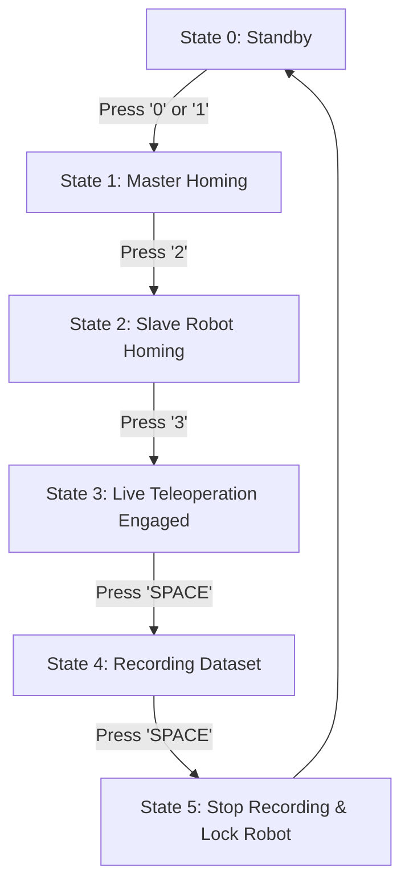

# HARVEST Teleoperation: Dual-Arm Teleoperation and Dataset Collection Guide

This package contains the **HARVEST Framework (Hand-admittance and Robotic Velocity-driven System for Low-Cost Teleoperation)**. It provides a multi-arm, prefix-isolated control architecture for the Kinova Gen3 (7-DOF) robotic arms and Robotiq 2F-85 grippers, supporting both simulation (fake hardware) and real-world execution, along with dataset collection capabilities for ACT (Action Chunking with Transformers).

---

## 📁 Prerequisites & Workspace Setup
Before running any nodes, make sure your ROS 2 Jazzy workspace is built and sourced in every terminal window.

```bash
# Build the workspace (run in the workspace root)
colcon build --symlink-install

# Source the workspace setup script
source install/setup.bash
```

---

## 📷 Webcam Alignment & Diagnostic Tool (Camera Setup)
Before starting data collection with the 4-point USB webcam setup, use the camera diagnostic tool to check camera positioning, alignment, real-time FPS, and fixed-focus settings.

```bash
python3 src/harvest_teleop/scripts/check_webcam.py
```

### 🔑 Hardware Serial Number Mapping (Persistent Identification)
The cameras are identified by persistent hardware serial numbers in `/dev/v4l/by-id/`, ensuring that **moving USB ports will NOT swap camera identities**:

| Position | Role | Serial Number | Persistent Device Symlink (`/dev/v4l/by-id/`) |
| :--- | :--- | :--- | :--- |
| **Cam 1** | **FRONT WEBCAM** | **`F1ADD37F`** | `..._F1ADD37F-video-index0` |
| **Cam 2** | **LEFT WRIST** | **`9328796F`** | `..._9328796F-video-index0` |
| **Cam 3** | **RIGHT WRIST** | **`6B24796F`** | `..._6B24796F-video-index0` |
| **Cam 4** | **TOP WEBCAM** | **`BEDDD37F`** | `..._BEDDD37F-video-index0` |

> [!NOTE]
> **Fixed Focus**: Auto-Focus is automatically disabled (`focus_automatic_continuous=0`) to prevent visual distribution shifts during ACT model training and inference.

---

## 🚀 Execution Guide (Step-by-Step)

To run the complete teleoperation and dataset collection pipeline, open **four separate terminals** and follow the steps below.

### 💻 Terminal 1: Launch Dual-Arm Driver
This node starts the robot description, controller manager, and robot state publishers for both left and right arms.

*   **Option A: Simulation (Fake Hardware & RViz)**
    Use this to test the system offline without physical robot arms.
    ```bash
    ros2 launch kortex_bringup gen3_dual.launch.py \
        robot_ip_1:=192.168.1.10 \
        robot_ip_2:=192.168.1.11 \
        prefix_1:=left_ \
        prefix_2:=right_ \
        use_fake_hardware:=true \
        gripper_1:=robotiq_2f_85 \
        gripper_2:=robotiq_2f_85 \
        launch_rviz:=true
    ```

*   **Option B: Real Hardware (Physical Arms)**
    Use this to control the actual physical Kinova Gen3 robots.
    ```bash
    ros2 launch kortex_bringup gen3_dual.launch.py \
        robot_ip_1:=192.168.1.10 \
        robot_ip_2:=192.168.1.11 \
        prefix_1:=left_ \
        prefix_2:=right_ \
        use_fake_hardware:=false \
        gripper_1:=robotiq_2f_85 \
        gripper_2:=robotiq_2f_85 \
        launch_rviz:=false
    ```

### 🕹️ Terminal 2: Launch Teleoperation Core
This node opens the serial connections to the master device arms, calculates control inputs (admittance and position error P-control), and commands the slave robots.
```bash
ros2 launch harvest_teleop harvest.launch.py arm_mode:=both
```

### 📊 Terminal 3: Launch GUI & Logger
*   **Option A: 4-Point USB Webcam Logger (Joint Space)**
    Uses 4 USB webcams with fixed focus and persistent serial mapping logging joint states.
    ```bash
    ros2 run harvest_teleop harvest_webcam_gui_logger
    ```

*   **Option B: 4-Point USB Webcam Logger (Cartesian Space - Recommended for ACT)**
    Logs End-Effector Cartesian poses (XYZ + Quaternion) via TF + Gripper state along with 4 USB webcams.
    ```bash
    ros2 run harvest_teleop harvest_webcam_cartesian_gui_logger
    ```

*   **Option C: Hybrid RealSense IR + Ensenso Logger (Legacy)**
    Uses 2 RealSense D435i (IR Grayscale Clean) + 1 Ensenso N46 3D camera + 1 Front Webcam.
    ```bash
    ros2 run harvest_teleop harvest_gui_logger
    ```

### ⌨️ Terminal 4: Launch Keyboard Interface (Homing & Recording Control)
This interface commands safety triggers, homing procedures, and controls the start/stop state of the dataset recorder.
```bash
ros2 run harvest_teleop keyboard_node
```

---

## 🔒 Safety State & Homing Flow (Keyboard Control)
The teleoperation core implements a safety-state machine to prevent arm sagging and ensure smooth initialization. 

When you run the **Keyboard Interface** (Terminal 4), follow this key sequence to engage control:



1.  **State 0 (Standby)**: System is idle.
2.  **State 1 (Master Homing - press `0` or `1`)**: The master arm moves autonomously to its home position.
3.  **State 2 (Slave Homing - press `2`)**: The Kinova Gen3 slave arms move autonomously to their home positions.
4.  **State 3 (Live Teleop - press `3`)**: Switches controllers on the arms to velocity control and loosens master servo torque. **Teleoperation is now active.**
5.  **State 4 (Start Recording - press `SPACE`)**: Seamlessly starts recording arm trajectories and camera feeds to an HDF5 dataset.
6.  **State 5 (Stop & Lock - press `SPACE`)**: Stops logging, saves the dataset, locks the master device torque, and switches the slave robots back to position trajectory controllers to prevent sagging.
